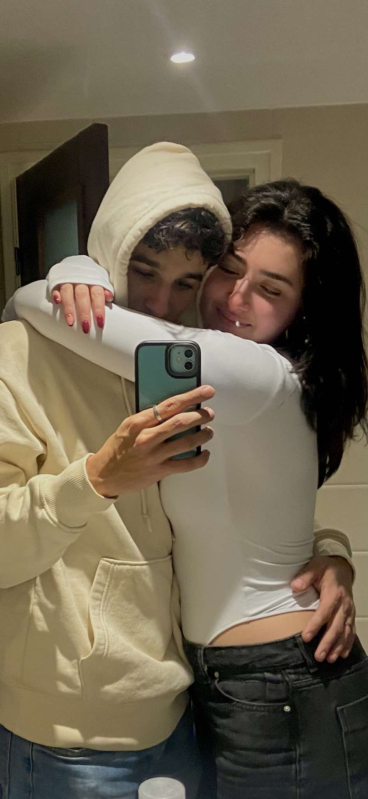
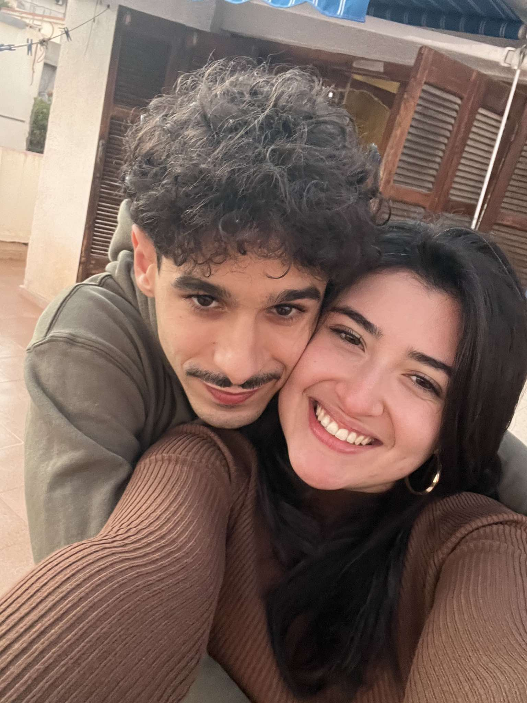
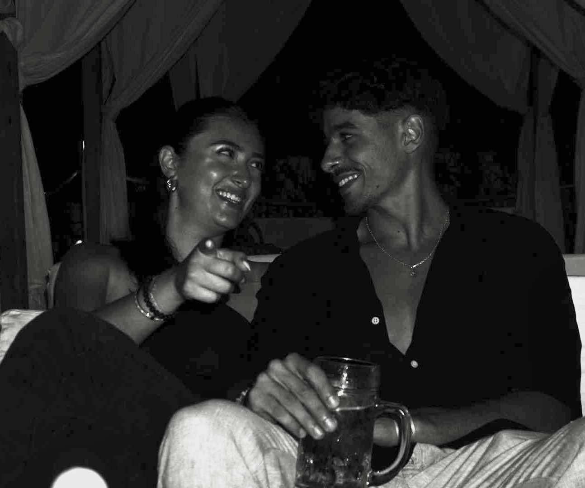

<html lang="fr">
<head>
    <meta charset="UTF-8">
    <meta name="viewport" content="width=device-width, initial-scale=1.0">
    <title>Pour Toi, Mon Amour ❤️</title>
    <link href="https://fonts.googleapis.com/css2?family=Poppins:wght@400;600&display=swap" rel="stylesheet">
    
</head>
<body>
    <!-- Écran de chargement -->
    

        
Chargement en cours...

        

            

        

    

   

        

            
            
            
            
            
            
            
            
        

        

            <h2>Man chat, tu veux bien être ma Valentine ? ❤️</h2>
            

            

                <button class="yes" onclick="showLove()">Oui</button>
                <button class="no" onclick="moveButton(this)">Non</button>
            

        

       

    

        

    

    

        
Mon amour, je t'aime ❤️

    

<button class="open-letter-btn" onclick="openLetter()"> ❤️</button>

        
    

    
</body>
</html>
